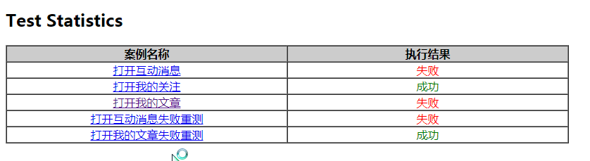
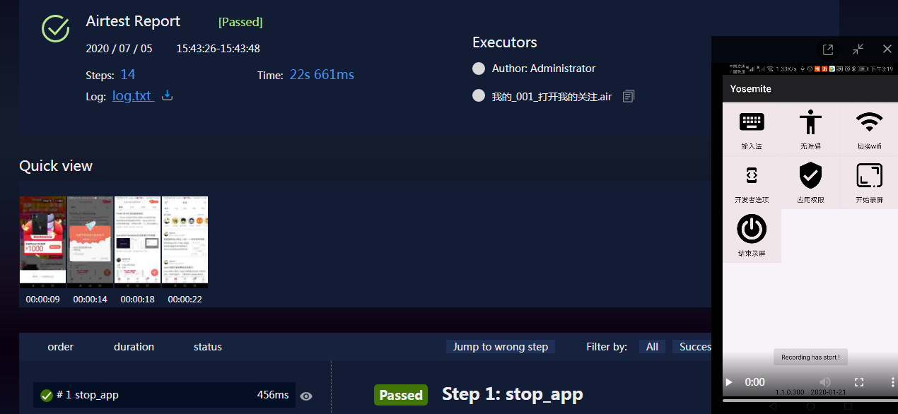

#  概述
- 用airtest做移动端自动化
- 暂时只支持安卓
- 基于yml编写用例


## 开始运行

### 运行模块用例：
- 打开```runner1.py```

```buildoutcfg
    root_path = PATH("air_case")
  # test_plan=1 表示调试用例执行，执行某几个模块用例；0表示全部模块用例
    data = {"root_path": root_path, "test_plan": 0, "test_module": [], "dev": "TPG5T18130013404", "phone": "Nova2s"}
    # data = {"root_path": root_path, "test_plan": 1, "test_module": ["他的"], "dev": "TPG5T18130013404", "phone": "Nova2s"}
    run_case(data)

```


### 运行单模块用例


- 打开runner2.py

```buildoutcfg
root_path = PATH("air_case/我的")
test_plan = 1  # 0表示运行我的模块下所有用例；1表示运行我的模块下的test_data里面的用例
test_data = ["打开我的文章.air"]
run_case({"root_path": root_path, "test_plan": test_plan, "test_data": test_data,  "dev": "TPG5T18130013404",
          "phone": "Nova2s"})
```


## 测试报告


 
   
## 其他
[查看我的changelog](changelog.MD)
