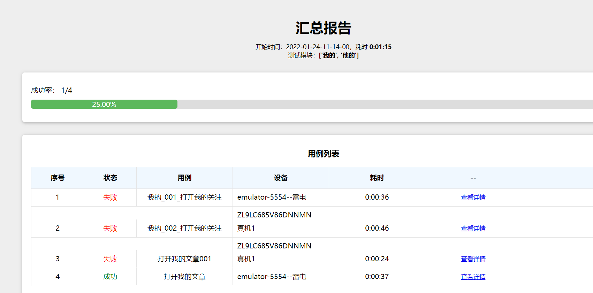

# 说明
- 本教程是在win系统下大家jenkins
## 准备
- 本地搭建好java的jdk环境
- 下载[jenkins.war](https://www.jenkins.io/download/)

## 启动
- ```java -jar jenkins.war```
- 浏览器中输入```http://localhost:8080/```
- 若一直提示加载中，需要在jenkins工作路面设置国内镜像，再次重启就可以了
```commandline
C:\Users\Administrator\.jenkins\hudson.model.UpdateCenter.xml

<?xml version='1.1' encoding='UTF-8'?>
<sites>
  <site>
    <id>default</id>
    <url>https://mirrors.tuna.tsinghua.edu.cn/jenkins/updates/update-center.json</url>
  </site>
</sites>
```
- 输入密码后，下载HTMl插件

## 创建job
### 设置构建和构建后的html展示
- 使用python命令启动runner1.py


## 立即构建
- 立即构建后，可以查看到测试报告，但是无法点击标题进入详情页

- 需要做如下设置
```commandline
jenkins->系统管理->脚本命令行（Script Console）,执行命令
System.setProperty("hudson.model.DirectoryBrowserSupport.CSP", "")
```
- 然后刷新页面（若不行，就重启jenkins），点击就可以进入到了详情页
